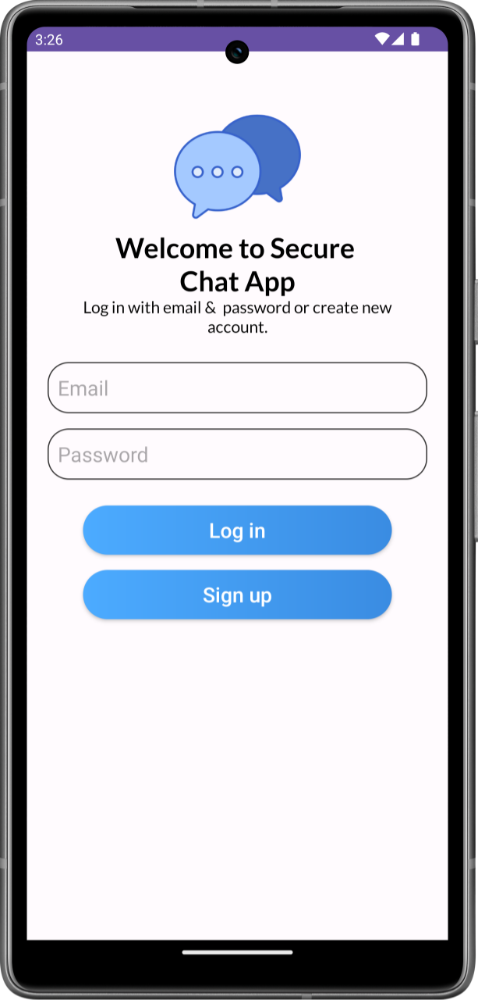
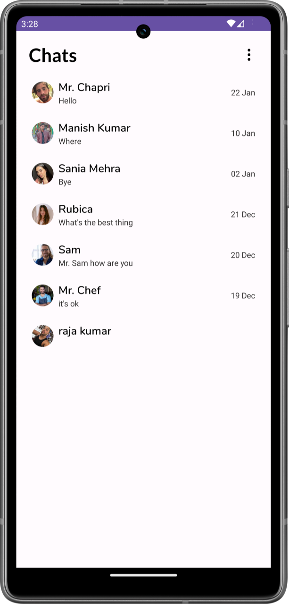
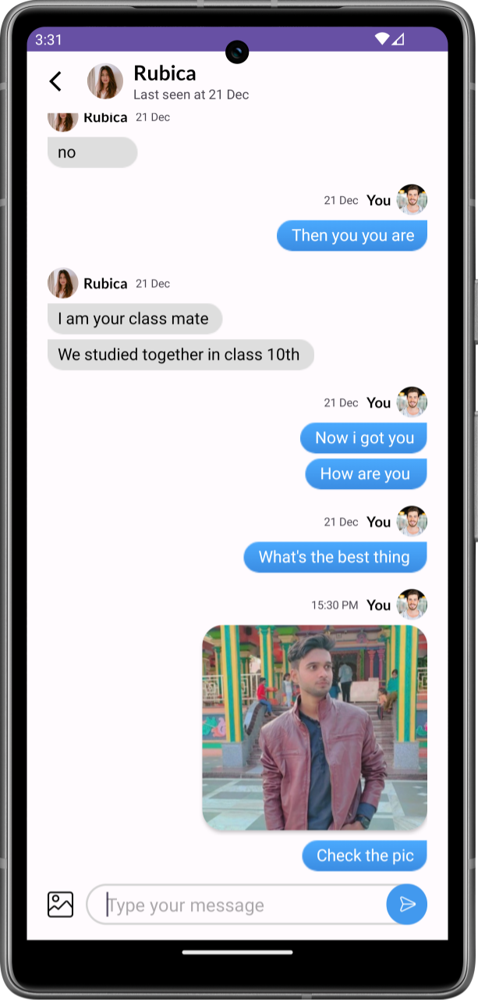

# Secure Chat App (Android)

Welcome to my Secure Chat project! This Android application is crafted to offer seamless communication and connection through intuitive messaging features, showcasing my expertise in mobile app development using Kotlin.

## Overview

Secure Chat is a versatile chat application designed to simplify communication between individuals. With an emphasis on user experience and functionality, it provides a platform for instant messaging and image sharing.

<h2 align="left">

Screenshots
</h2>

## Features

### Instant Messaging

- **Real-time Chat**: Engage in instant one-on-one or group conversations with friends and family.

### Media Sharing

- **Photo Sharing**: Share memorable moments with others through photos within the chat.

### Security and Privacy

 **Privacy Controls**: Manage privacy settings, including last seen status.

## Technologies Used

- **Language**: 100% Kotlin
- **Development Platform**: Android Studio
- **Backend**: Firebase
- **Authentication**: Firebase Authentication
- **Architecture pattern**: MVVM(Google's Recommended)

## Installation

The Secure Chat App is currently available for Android devices only. To install the app, follow these steps:

1. [Download Apk](https://manish99verma.github.io/my-portfolio/assets/apks/secure-chat.apk)
2. Enable installation from unknown sources in your device settings.
3. Install the APK file on your Android device.
4. Open the app and start enjoying Secure Chat!

## Contact

For any inquiries or feedback, feel free to reach out to me at manish6203993@gmail.com
